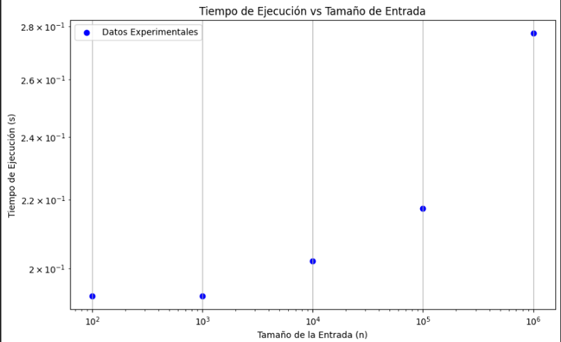
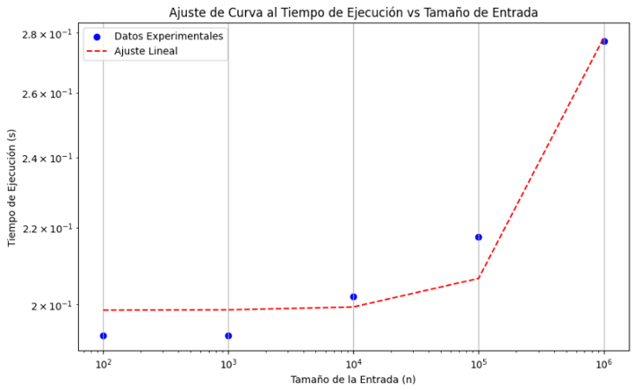
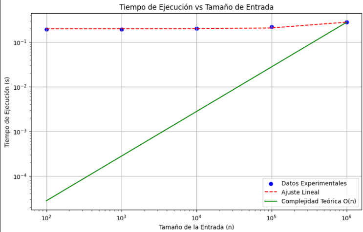

# COMPUTACION Y ESTRUCTURAS DISCRETAS II
## TAREA INTEGRADORA FINAL

### INTEGRANTES
- Damy Villegas – A00398942
- Juan Manuel Zuluaga – A00399738
- Juan Esteban Gómez – A00400293

### 1) Algoritmo CheckSum 

Este algoritmo es una técnica utilizada para verificar la integridad de datos transmitidos o almacenados, su objetivo principal es detectar errores en los datos. Esto se lo hace calculando un valor (el checksum) a partir de los datos originales, para luego utilizarlos y comprobar si los datos han sido alterados o corrompidos.

En nuestro proyecto la clase que incorpora este algoritmo se llama ‘CheckSumCalculator’, la cual proporciona una manera de calcular y a la vez verificar checksums tanto para secuencias de bytes como para cadenas de texto. El proceso de calculo checksum implica sumar los valores de los bytes asegurándose que el resultado este dentro del rango de un byte. Su verificación se realiza comparando el checksum con un checksum previamente obtenido para determinar si los datos han sido alterados. 

#### COMPLEJIDAD DEL ALGORITMO 

Calculamos la complejidad de nuestro algoritmo en términos de 𝑂(𝑛), donde n es el tamaño de los datos de entrada, esto lo hicimos para cada función definida en nuestro algoritmo: 

- `def calculate(data: Array[Byte]): Int = {}`
  Esta función recorre todos los elementos de un Array data, realizando una operación constante en cada uno. La complejidad de esta función es 𝑂(𝑛), donde n es el numero de elementos que hay en data.
  
- `def calculateChecksum(data: String): Int = {}`
  Esta función convierte una cadena en un array de bytes, lo cual tiene una complejidad de 𝑂(𝑛), donde n es la longitud de la cadena data.
  
- `def verifyChecksumCalculate(data: Array[Byte], checksum: Int): Boolean = {}`
  La complejidad total de esta función es 𝑂(𝑛), donde 𝑛 es el número de elementos en data.
  
- `def verifyChecksumCalculateChecksum(data: String, checksum: Int): Boolean = {}`
  La complejidad total de esta función es 𝑂(𝑛), donde 𝑛 es la longitud de la cadena data.

En todas las funciones, la complejidad es lineal 𝑂(𝑛), donde 𝑛 representa el tamaño de los datos de entrada ya sea el número de bytes en un array o la longitud de una cadena.

#### MEDICION DEL TIEMPO DE EJECUCION 

Nosotros definimos unos valores específicos para poder calcular dicha medición, y al implementar nuestro código checksum, nos dio los siguientes resultados:

### A) Organizamos los datos en una tabla:

| SIZE    | EXEC TIME1 (S) | EXEC TIME2 (S) | EXEC TIME3 (S) | EXEC TIME4 (S) | EXEC TIME5 (S) |
|---------|----------------|----------------|----------------|----------------|----------------|
| 100     | 0.188          | 0.187          | 0.172          | 0.196          | 0.219          |
| 1000    | 0.188          | 0.187          | 0.172          | 0.196          | 0.219          |
| 10000   | 0.188          | 0.187          | 0.188          | 0.212          | 0.235          |
| 100000  | 0.203          | 0.203          | 0.203          | 0.227          | 0.251          |
| 1000000 | 0.266          | 0.266          | 0.251          | 0.290          | 0.313          |

### B) Calculamos los promedios, lo que da lugar a una nueva tabla: 

| SIZE    | EXEC TIME1 (S) | EXEC TIME2 (S) | EXEC TIME3 (S) | EXEC TIME4 (S) | EXEC TIME5 (S) | AVG EXEC TIME (S) |
|---------|----------------|----------------|----------------|----------------|----------------|-------------------|
| 100     | 0.188          | 0.187          | 0.172          | 0.196          | 0.219          | 0.1924            |
| 1000    | 0.188          | 0.187          | 0.172          | 0.196          | 0.219          | 0.1924            |
| 10000   | 0.188          | 0.187          | 0.188          | 0.212          | 0.235          | 0.202             |
| 100000  | 0.203          | 0.203          | 0.203          | 0.227          | 0.251          | 0.2174            |
| 1000000 | 0.266          | 0.266          | 0.205          | 0.290          | 0.313          | 0.268             |

# Resultados de Análisis de Algoritmos y Complejidad

Los puntos azules representan los tiempos de ejecución promedio para cada tamaño de entrada. Observamos un aumento ligero del tiempo de ejecución conforme crece el tamaño de la entrada, lo cual es consistente con una complejidad lineal O(n).

### C) Curva Analítica 
Como ya sabemos que el algoritmo checksum tiene una complejidad lineal O(n), ajustamos una línea recta (función lineal) a los datos experimentales para ver como se compara con la complejidad teórica, para esto utilizamos la formula f(n) = a.n+b donde a y b son parámetros para determinar.

Los puntos azules determinan los tiempos de ejecución promedio para cada tamaño de entrada, la línea roja punteada representa el ajuste lineal a los datos experimentales, obtenida mediante una regresión lineal. 
Este ajuste lineal muestra que el tiempo de ejecución aumenta de manera aproximadamente lineal con el tamaño de la entrada, lo cual es equivalente a la complejidad teórica O(n). 

### D) Comparación con la Complejidad Teórica 

La línea verde continua que representa la complejidad teórica O(n) coincide con el ajuste lineal, confirmando que el algoritmo checksum sigue una complejidad lineal. Concluimos que el tiempo de ejecución aumenta linealmente con el tamaño de la entrada, consistente con la complejidad teórica O(n).

## Algoritmo CRC
## Clase DataGemerator

La clase `DataGenerator` proporciona métodos para generar datos aleatorios, útiles para pruebas y simulaciones. Sus funciones incluyen:

- Generación de Arrays de Bytes Aleatorios
- Generación de Cadenas de Texto Aleatorias
- Rangos de Tamaño Basados en Categorías
- Generación de Datos de Texto en Formato Byte

Esas funcionalidades son de gran importancia para poder realizar las pruebas y simulaciones cuando se proporciona datos de entrada de manera aleatoria, adaptándose a diferentes requisitos de tamaño.

#### COMPLEJIDAD DEL ALGORITMO 

Para calcular su complejidad analizamos cada uno de los métodos o definiciones por separado: 

-	`def generateData(size: Int): Array[Byte] = {}`
La complejidad total de este método es 𝑂(𝑛), donde n es el tamaño del array `size`.

-	`def generateString(minis: Int, maxSize: Int): String = {}`
La complejidad es 𝑂(𝑛), donde n es el tamaño de la cadena generada. 

-	`def chooseSizeRange(category: String): (Int, Int) = {}`
Este método verifica la categoría y devuelve un par de enteros, estas operaciones son constantes, por lo que su complejidad total es 𝑂(1).

-	`def generateStringData(category: String): Array[Byte] = {}`
La complejidad total de este método es 𝑂(𝑛), donde n es el tamaño de la cadena generada.

La complejidad algorítmica total de los métodos en esta clase es O(n), indicando un tiempo de ejecución proporcional al tamaño de los datos generados.

## Clase DataLoader

## Clase Conver

La clase `Conver` contiene métodos para convertir datos entre diferentes formatos, como cadenas de texto, representaciones binarias, ASCII y hexadecimal. 

Los métodos creados pueden convertir una cadena de texto a representaciones binarias en su equivalente binario el cual es de 8 bits, o viceversa mente, ya que también convierte una cadena de texto en formato binario de 8 bits a su representación de texto original. De igual forma además de convertir cadenas de texto a representaciones binarias, las puede representar en ASCII decimal (formato digital de 3 dígitos), o en una representación Hexadecimal en mayúsculas

#### COMPLEJIDAD DEL ALGORITMO 

-	`stringToBinary(str: String): String`
La complejidad total de este método es 𝑂(𝑛), donde n es la longitud de la cadena `str`.

-	`binaryToString(binary: String): String`
La complejidad total de este método es 𝑂(𝑛), donde n es la longitud de la cadena `binary`.

-	`stringToAscii(inputString: String): String`
La complejidad total de este método es 𝑂(𝑛), donde n es la longitud de la cadena `inputString`.

-	`decimalToHex(decimal: Int): String`
La complejidad total del algoritmo es de 𝑂(1), porque cuando se convierte una cadena a mayúsculas se opera sobre una cadena de longitud fija, además de ser una cadena hexadecimal, es decir que es una operación constante puesto que el tamaño del entero es constante.

La complejidad de los métodos varía, siendo lineal O(n) para métodos que procesan cadenas y constante O(1) para el método de conversión de decimal a hexadecimal.

## Clase ExecutionTimer

Nuestra clase ExecutionTimer es una herramienta útil para medir el tiempo de ejecución de bloques de código en nanosegundos, lo que facilita la optimización y evaluación del rendimiento en aplicaciones y algoritmos.

#### COMPLEJIDAD DEL ALGORITMO 

Este método a pesar de que mide el tiempo de ejecución de un bloque de código, su complejidad algorítmica no depende del bloque de código en sí, sino de la operación de medición de tiempo, la cual es generalmente considerada como constante. En nuestra implementación utilizamos ‘System.nanoTime()’, lo cual se considera de complejidad 𝑂(1).

Por lo tanto, la complejidad algorítmica de este método es 𝑂(1), ya que la operación de medición del tiempo no depende del tamaño del bloque de código o, de entrada.  

