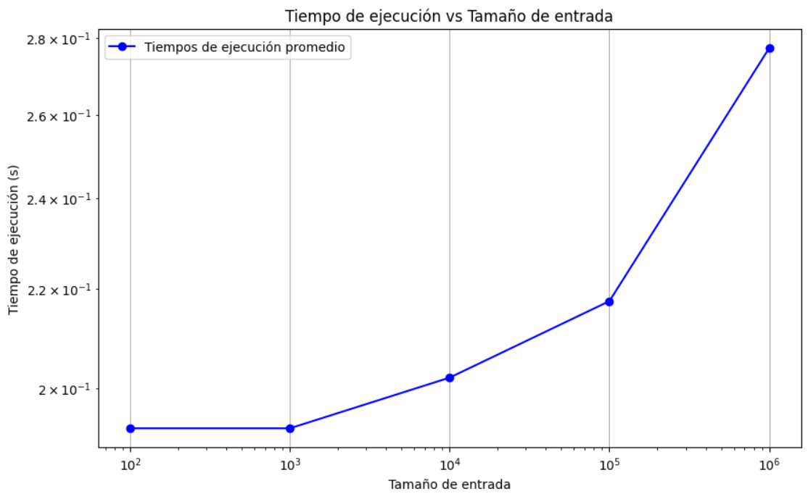
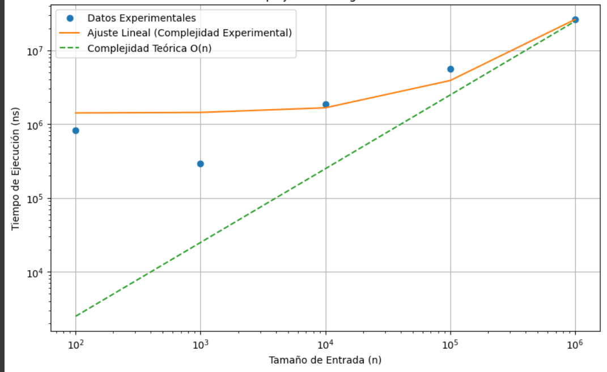
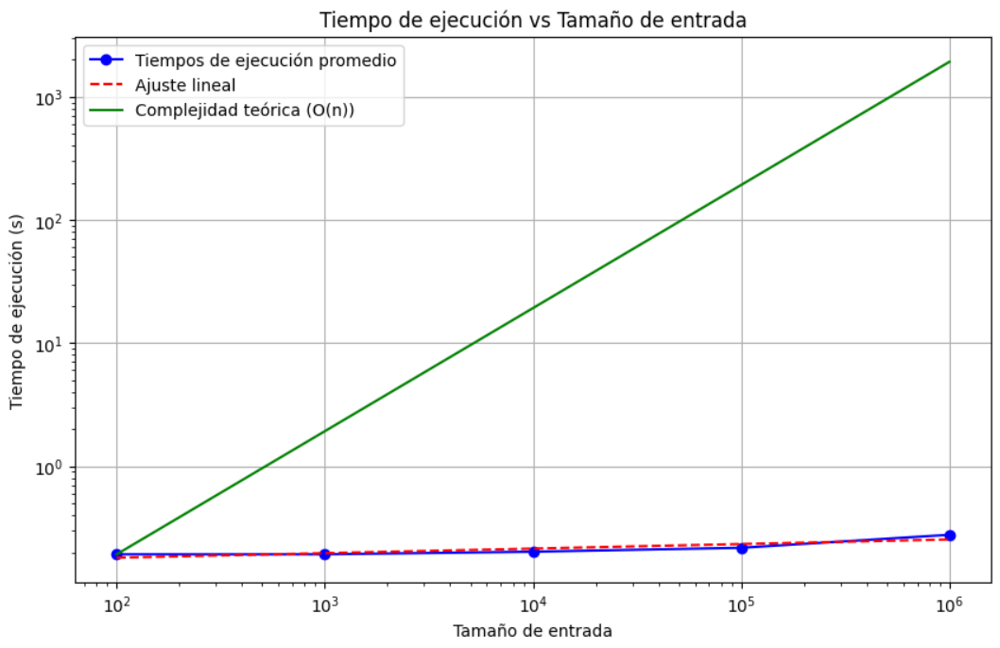

# COMPUTACION Y ESTRUCTURAS DISCRETAS II
## TAREA INTEGRADORA FINAL

### INTEGRANTES
- Damy Villegas – A00398942
- Juan Manuel Zuluaga – A00399738
- Juan Esteban Gómez – A00400293

### 1) Algoritmo CheckSum 

Este algoritmo es una técnica utilizada para verificar la integridad de datos transmitidos o almacenados, su objetivo principal es detectar errores en los datos. Esto se lo hace calculando un valor (el checksum) a partir de los datos originales, para luego utilizarlos y comprobar si los datos han sido alterados o corrompidos.

En nuestro proyecto la clase que incorpora este algoritmo se llama ‘CheckSumCalculator’, la cual proporciona una manera de calcular y a la vez verificar checksums tanto para secuencias de bytes como para cadenas de texto. El proceso de calculo checksum implica sumar los valores de los bytes asegurándose que el resultado este dentro del rango de un byte. Su verificación se realiza comparando el checksum con un checksum previamente obtenido para determinar si los datos han sido alterados. 

#### COMPLEJIDAD DEL ALGORITMO 

Calculamos la complejidad de nuestro algoritmo en términos de 𝑂(𝑛), donde n es el tamaño de los datos de entrada, esto lo hicimos para cada función definida en nuestro algoritmo: 

- `def calculate(data: Array[Byte]): Int = {}`
  Esta función recorre todos los elementos de un Array data, realizando una operación constante en cada uno. La complejidad de esta función es 𝑂(𝑛), donde n es el numero de elementos que hay en data.
  
- `def calculateChecksum(data: String): Int = {}`
  Esta función convierte una cadena en un array de bytes, lo cual tiene una complejidad de 𝑂(𝑛), donde n es la longitud de la cadena data.
  
- `def verifyChecksumCalculate(data: Array[Byte], checksum: Int): Boolean = {}`
  La complejidad total de esta función es 𝑂(𝑛), donde 𝑛 es el número de elementos en data.
  
- `def verifyChecksumCalculateChecksum(data: String, checksum: Int): Boolean = {}`
  La complejidad total de esta función es 𝑂(𝑛), donde 𝑛 es la longitud de la cadena data.

En todas las funciones, la complejidad es lineal 𝑂(𝑛), donde 𝑛 representa el tamaño de los datos de entrada ya sea el número de bytes en un array o la longitud de una cadena.

#### MEDICION DEL TIEMPO DE EJECUCION 

Nosotros definimos unos valores específicos para poder calcular dicha medición, y al implementar nuestro código checksum, nos dio los siguientes resultados:

### A) Organizamos los datos en una tabla:

| SIZE    | EXEC TIME1 (S) | EXEC TIME2 (S) | EXEC TIME3 (S) | EXEC TIME4 (S) | EXEC TIME5 (S) |
|---------|----------------|----------------|----------------|----------------|----------------|
| 100     | 0.188          | 0.187          | 0.172          | 0.196          | 0.219          |
| 1000    | 0.188          | 0.187          | 0.172          | 0.196          | 0.219          |
| 10000   | 0.188          | 0.187          | 0.188          | 0.212          | 0.235          |
| 100000  | 0.203          | 0.203          | 0.203          | 0.227          | 0.251          |
| 1000000 | 0.266          | 0.266          | 0.251          | 0.290          | 0.313          |

### B) Calculamos los promedios, lo que da lugar a una nueva tabla: 

| SIZE    | EXEC TIME1 (S) | EXEC TIME2 (S) | EXEC TIME3 (S) | EXEC TIME4 (S) | EXEC TIME5 (S) | AVG EXEC TIME (S) |
|---------|----------------|----------------|----------------|----------------|----------------|-------------------|
| 100     | 0.188          | 0.187          | 0.172          | 0.196          | 0.219          | 0.1924            |
| 1000    | 0.188          | 0.187          | 0.172          | 0.196          | 0.219          | 0.1924            |
| 10000   | 0.188          | 0.187          | 0.188          | 0.212          | 0.235          | 0.202             |
| 100000  | 0.203          | 0.203          | 0.203          | 0.227          | 0.251          | 0.2174            |
| 1000000 | 0.266          | 0.266          | 0.205          | 0.290          | 0.313          | 0.268             |

# Resultados de Análisis de Algoritmos y Complejidad

Los puntos azules representan los tiempos de ejecución promedio para cada tamaño de entrada. Observamos un aumento ligero del tiempo de ejecución conforme crece el tamaño de la entrada, lo cual es consistente con una complejidad lineal O(n).

### C) Curva Analítica 
Como ya sabemos que el algoritmo checksum tiene una complejidad lineal O(n), ajustamos una línea recta (función lineal) a los datos experimentales para ver como se compara con la complejidad teórica, para esto utilizamos la formula f(n) = a.n+b donde a y b son parámetros para determinar.

Los puntos azules determinan los tiempos de ejecución promedio para cada tamaño de entrada, la línea roja punteada representa el ajuste lineal a los datos experimentales, obtenida mediante una regresión lineal. 
Este ajuste lineal muestra que el tiempo de ejecución aumenta de manera aproximadamente lineal con el tamaño de la entrada, lo cual es equivalente a la complejidad teórica O(n). 

### D) Comparación con la Complejidad Teórica 

La línea verde continua que representa la complejidad teórica O(n) coincide con el ajuste lineal, confirmando que el algoritmo checksum sigue una complejidad lineal. Concluimos que el tiempo de ejecución aumenta linealmente con el tamaño de la entrada, consistente con la complejidad teórica O(n).

## Algoritmo CRC
El algoritmo CRC (Cyclic Redundancy Check) es una técnica de detección de errores utilizada para verificar la integridad de datos en comunicaciones digitales y almacenamiento de datos. CRC genera una cadena corta de verificación llamada "checksum" a partir de los datos originales. Este checksum se envía junto con los datos. En el receptor, se recalcula el CRC y se compara con el checksum recibido. Si coinciden, se asume que los datos están libres de errores.

El algoritmo CRC se implementa en la clase CRCCalculator. Aquí se implementan dos versiones del algoritmo: una para trabajar con cadenas de texto (String) y otra para trabajar con matrices de bytes (Array[Byte]).

#### Complejidad del Algoritmo
Tanto para las operaciones sobre cadenas como para las operaciones sobre matrices de bytes, la complejidad de los métodos de CRC es O(n + m), donde 'n' representa la longitud de los datos o el número de elementos en las matrices y 'm' representa la longitud del generador.

- `Método calculate(data: String, generator: String): String:` En este método, se realizan operaciones sobre las cadenas data y generator, y también se crean nuevas cadenas. La longitud de estas cadenas influirá en la complejidad del método. la complejidad total del método calculate en términos de O(n) sería O(n + m), donde 'n' es la longitud de la cadena data y 'm' es la longitud de la cadena generator.

- `Método verify(data: String, checksum: String, generator: String):` Boolean: Este método llama al método calculate, por lo que su complejidad estará influenciada por la complejidad de calculate y las operaciones adicionales de comparación de cadenas. Dado que la complejidad de calculate es O(n + m), la complejidad de verify también será O(n + m), ya que las operaciones adicionales de comparación de cadenas tienen una complejidad lineal.

- `Método calculateBytes(data: Array[Byte], generator: Array[Byte]): Array[Byte]:` En este método, se realizan operaciones sobre las matrices de bytes data y generator. La longitud de estas matrices influirá en la complejidad del método. la complejidad total del método calculateBytes en términos de O(n) sería O(n + m), donde 'n' es el tamaño de la matriz data y 'm' es el tamaño de la matriz generator.

- `Método verifyBytes(data: Array[Byte], checksum: Array[Byte], generator: Array[Byte]):` Boolean: Este método llama al método calculateBytes, por lo que su complejidad estará influenciada por la complejidad de calculateBytes y las operaciones adicionales de comparación de matrices de bytes.

Dado que la complejidad de calculateBytes es O(n + m), la complejidad de verifyBytes también será O(n + m), ya que las operaciones adicionales de comparación de matrices de bytes tienen una complejidad lineal.

### Medición del tiempo de Ejecución 

Definimos unos valores específicos e implementamos con nuestro algoritmo CRC y nos dio los siguientes resultados:

1) **Organizamos los datos en una tabla** 

|SIZE|EXEC TIME1(S)|EXEC TIME2(S)|EXEC TIME3 (S)|EXEC TIME4 (S)|EXEC TIME5 (S)|
| :- | :- | :- | :- | :- | :- |
|100|0\.198|0\.214|0\.2|0\.186|0\.196|
|1000|0\.214|0\.221|0\.229|0\.216|0\.22|
|10000|0\.243|0\.255|0\.252|0\.236|0\.25|
|100000|0\.326|0\.322|0\.349|0\.302|0\.318|
|1000000|0\.57|0\.6|0\.613|0\.556|0\.587|

2) **Calculamos los promedios y nos da esta tabla**

|SIZE|EXEC TIME1(S)|EXEC TIME2(S)|EXEC TIME3 (S)|EXEC TIME4 (S)|EXEC TIME5 (S)|AVG EXEC TIME(S)|
| :- | :- | :- | :- | :- | :- | :- |
|100|0\.198|0\.214|0\.2|0\.186|0\.196|0\.1988|
|1000|0\.214|0\.221|0\.229|0\.216|0\.22|0\.22|
|10000|0\.243|0\.255|0\.252|0\.236|0\.25|0\.2472|
|100000|0\.326|0\.322|0\.349|0\.302|0\.318|0\.3234|
|1000000|0\.57|0\.6|0\.613|0\.556|0\.587|0\.5852|

**Resultados de análisis de algoritmo y complejidad** 

Los puntos azules que indican los tiempos de ejecución promedio para cada tamaño de entrada.

**Curva analítica**

La línea roja punteada representa el mejor ajuste lineal en una escala logarítmica, que luego se transforma de vuelta a la escala original para comparar con los datos experimentales. Esta línea muestra cómo los tiempos de ejecución promedio crecen aproximadamente de manera lineal con el tamaño de la entrada en la escala logarítmica, lo cual confirma la complejidad lineal del algoritmo CRC.

**Comparación con la complejidad teórica** 

La gráfica muestra cómo los tiempos de ejecución experimentales se comparan tanto con el ajuste lineal como con la complejidad teórica del algoritmo. Esto confirma que el algoritmo sigue una complejidad lineal.
## Clase DataGemerator

La clase `DataGenerator` proporciona métodos para generar datos aleatorios, útiles para pruebas y simulaciones. Sus funciones incluyen:

- Generación de Arrays de Bytes Aleatorios
- Generación de Cadenas de Texto Aleatorias
- Rangos de Tamaño Basados en Categorías
- Generación de Datos de Texto en Formato Byte

Esas funcionalidades son de gran importancia para poder realizar las pruebas y simulaciones cuando se proporciona datos de entrada de manera aleatoria, adaptándose a diferentes requisitos de tamaño.

#### COMPLEJIDAD DEL ALGORITMO 

Para calcular su complejidad analizamos cada uno de los métodos o definiciones por separado: 

-	`def generateData(size: Int): Array[Byte] = {}`
La complejidad total de este método es 𝑂(𝑛), donde n es el tamaño del array `size`.

-	`def generateString(minis: Int, maxSize: Int): String = {}`
La complejidad es 𝑂(𝑛), donde n es el tamaño de la cadena generada. 

-	`def chooseSizeRange(category: String): (Int, Int) = {}`
Este método verifica la categoría y devuelve un par de enteros, estas operaciones son constantes, por lo que su complejidad total es 𝑂(1).

-	`def generateStringData(category: String): Array[Byte] = {}`
La complejidad total de este método es 𝑂(𝑛), donde n es el tamaño de la cadena generada.

La complejidad algorítmica total de los métodos en esta clase es O(n), indicando un tiempo de ejecución proporcional al tamaño de los datos generados.

## Clase DataLoader

Determinamos la complejidad de la clase `DataLoader` analizando cada metodo individualmente:

- `loadTextFile(fileName: String):`
La complejidad de este método depende del tamaño del archivo que se está cargando. Si el tamaño del archivo es proporcional al tamaño de entrada, la complejidad de este método sería O(n), donde n es el tamaño del archivo.

- `loadAllTextFiles():`
La complejidad de este metodo depende de la cantidad de archivos y del tamaño de cada archivo en la carpeta, por ejemplo si tenemos `m` archivos en la carpeta y el total de todos los archivos es `n`, entonces la complejidad de el metodo seria O(m*n), donde n es el tamaño de cada archivo.

- `saveToTextFile(fileName: String, array: Array[String]):`
Este metodo como guarda un array de strings en un archivo de texto, la complejidad del metodo depende del tamaño del array (k). Por tal razon la complejidad seria O(k).
 
## Clase Conver

La clase `Conver` contiene métodos para convertir datos entre diferentes formatos, como cadenas de texto, representaciones binarias, ASCII y hexadecimal. 

Los métodos creados pueden convertir una cadena de texto a representaciones binarias en su equivalente binario el cual es de 8 bits, o viceversa mente, ya que también convierte una cadena de texto en formato binario de 8 bits a su representación de texto original. De igual forma además de convertir cadenas de texto a representaciones binarias, las puede representar en ASCII decimal (formato digital de 3 dígitos), o en una representación Hexadecimal en mayúsculas

#### COMPLEJIDAD DEL ALGORITMO 

-	`stringToBinary(str: String): String`
La complejidad total de este método es 𝑂(𝑛), donde n es la longitud de la cadena `str`.

-	`binaryToString(binary: String): String`
La complejidad total de este método es 𝑂(𝑛), donde n es la longitud de la cadena `binary`.

-	`stringToAscii(inputString: String): String`
La complejidad total de este método es 𝑂(𝑛), donde n es la longitud de la cadena `inputString`.

-	`decimalToHex(decimal: Int): String`
La complejidad total del algoritmo es de 𝑂(1), porque cuando se convierte una cadena a mayúsculas se opera sobre una cadena de longitud fija, además de ser una cadena hexadecimal, es decir que es una operación constante puesto que el tamaño del entero es constante.

La complejidad de los métodos varía, siendo lineal O(n) para métodos que procesan cadenas y constante O(1) para el método de conversión de decimal a hexadecimal.

## Clase ExecutionTimer

Nuestra clase ExecutionTimer es una herramienta útil para medir el tiempo de ejecución de bloques de código en nanosegundos, lo que facilita la optimización y evaluación del rendimiento en aplicaciones y algoritmos.

#### COMPLEJIDAD DEL ALGORITMO 

Este método a pesar de que mide el tiempo de ejecución de un bloque de código, su complejidad algorítmica no depende del bloque de código en sí, sino de la operación de medición de tiempo, la cual es generalmente considerada como constante. En nuestra implementación utilizamos ‘System.nanoTime()’, lo cual se considera de complejidad 𝑂(1).

Por lo tanto, la complejidad algorítmica de este método es 𝑂(1), ya que la operación de medición del tiempo no depende del tamaño del bloque de código o, de entrada.  

RESPUESTAS A LAS PREGUNTAS:

### ¿Hay algún patrón discernible en la relación entre el tamaño de la entrada y el tiempo de ejecución?

CHECKSUM
- Patrón Observado: A medida que el tamaño de la entrada aumenta, el tiempo de ejecución también aumenta de manera lineal. Esto se debe a la complejidad lineal 𝑂(𝑛) del algoritmo, que implica que el tiempo de ejecución es directamente proporcional al número de elementos en la entrada.
  
- Confirmación con Gráfica: La gráfica de "Tiempo de Ejecución vs Tamaño de Entrada" muestra un incremento lineal en el tiempo de ejecución conforme crece el tamaño de la entrada, lo cual coincide con la complejidad teórica 𝑂(𝑛).

CRC
- Patrón Observado: Similar al algoritmo CheckSum, el tiempo de ejecución del algoritmo CRC incrementa de manera lineal conforme aumenta el tamaño de la entrada. Esto es consistente con la complejidad lineal 𝑂(𝑛), donde el tiempo de ejecución es proporcional al número de bytes procesados.
  
- Confirmación con Gráfica: La relación lineal indicada por los datos sugiere un comportamiento similar al de CheckSum, confirmando la complejidad teórica 𝑂(𝑛).
  
En conclusión, Ambos algoritmos, CheckSum y CRC, muestran un patrón claro y discernible donde el tiempo de ejecución aumenta linealmente con el tamaño de la entrada.

### ¿Qué tipo de relación parece existir entre el tamaño de la entrada y el tiempo de ejecución? (lineal, cuadrática, exponencial, etc.)

Tanto para el algoritmo CheckSum como el algoritmo CRC, su relacion entre el tamaño y el tiempo de ejecucion es lineal. 

### ¿Qué función se ajusta mejor a los datos experimentales? (lineal, cuadrática, exponencial, etc.)

Tanto para la grafica del algoritmo Checksum como el CRC, en la grafica "Tiempo de Ejecucion vs Tamaño de Entrada", muestran un incremento lineal de la forma f(n)=a⋅n+b, asi que nuestro analisis es que la funcion lineal se ajusta de una mejor forma a los datos experimentales en Checksum y en CRC

### ¿Cómo se compara la función de ajuste con la complejidad teórica del algoritmo?

El algoritmo Checksum y el algoritmo CRC comparten similitudes en cuanto a su complejidad teórica y su comportamiento práctico. Ambos presentan una complejidad teórica de O(n), donde n es el tamaño de la entrada, lo que implica que su tiempo de ejecución aumenta de manera proporcional al tamaño de los datos de entrada.

Este comportamiento se confirma mediante datos experimentales, que muestran un incremento lineal en el tiempo de ejecución a medida que crece el tamaño de la entrada. La función de ajuste a estos datos se modela de manera lineal, lo que coincide con la complejidad teórica esperada.

En resumen, tanto la teoría como la práctica demuestran que tanto el algoritmo Checksum como el algoritmo CRC operan de manera eficiente y predecible, con un tiempo de ejecución que crece de forma lineal con el tamaño de la entrada.

### ¿La complejidad teórica del algoritmo predice adecuadamente el tiempo de ejecución observado en los datos experimentales?

En ambos casos, la complejidad teórica O(n) proporciona una predicción adecuada y precisa del tiempo de ejecución observado en los datos experimentales. La función de ajuste lineal f(n)=a⋅n+b, obtenida a partir de los resultados experimentales, confirma que el tiempo de ejecución de los algoritmos CheckSum y CRC aumenta linealmente con el tamaño de la entrada, tal como lo predice la complejidad teórica. Esto demuestra la validez y precisión de la complejidad teórica en la descripción del rendimiento temporal de estos algoritmos.

### ¿Hay algún tamaño de entrada para el cual el algoritmo exhiba un comportamiento inusual en términos de tiempo de ejecución?

Segun los datos obtenidos no parece haber un tamaño de entrada para el cual el algoritmo presente un comportamiento inusual en los terminos de ejecución.

